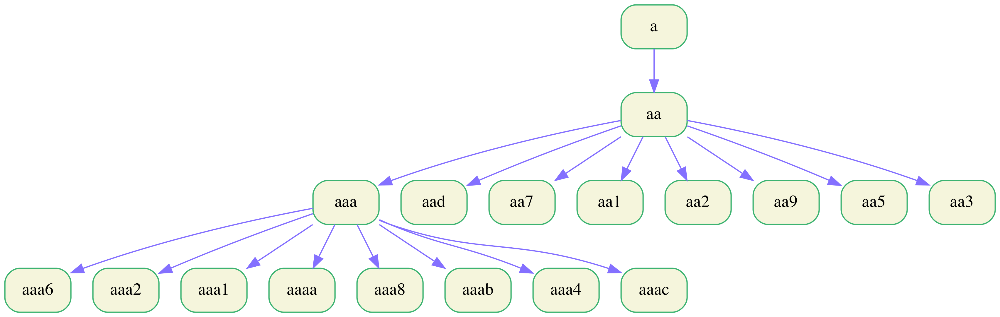

# Algorithm Overview

This is unsupervised learning algorithm where patterns are identified and clustered hierarchically. These patterns are extracted from the tags recursively by capturing single character at a time. Finally, we get a dictionary of all patterns that we can visualize in a tree structure:

The above figure shows the starting pattern search from the starting of all tags. Similar we do for ending pattern search. The stoping criteria of any tree branch checks if pattern is reflected in at-least 'n' number of tags. Once all the patterns are extracted based on threshold 'n', every tag is mapped to a pattern of longest length possible. This exercise is performed separately for every customer.